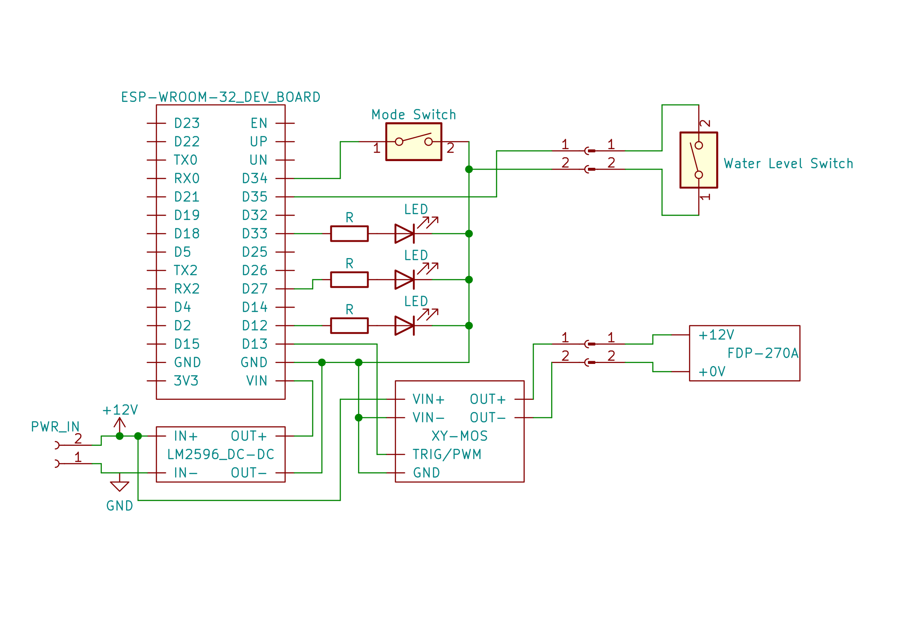
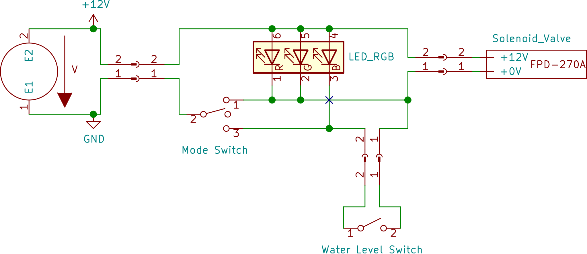
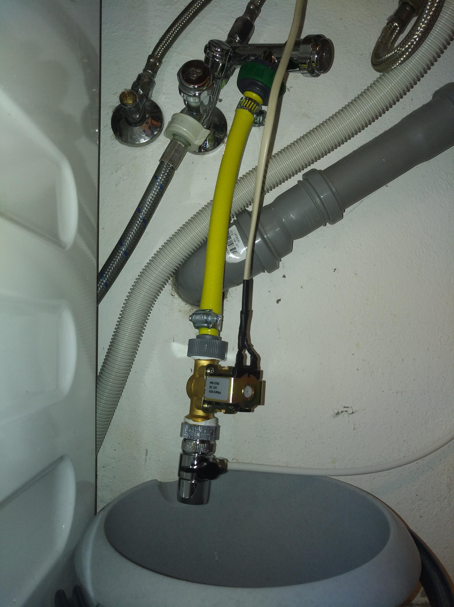
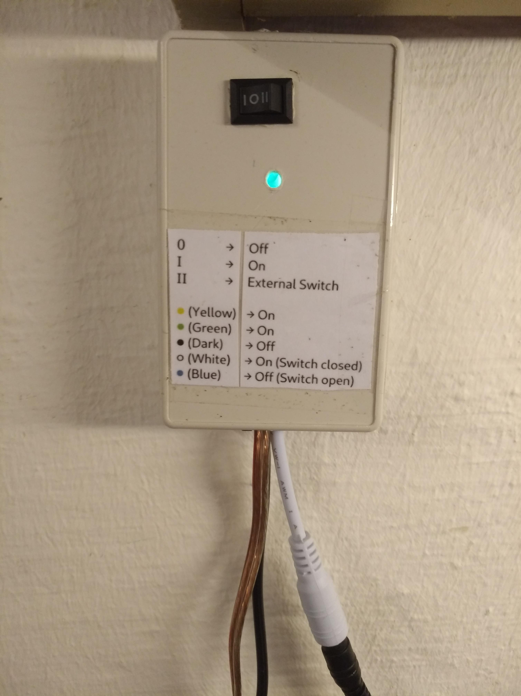
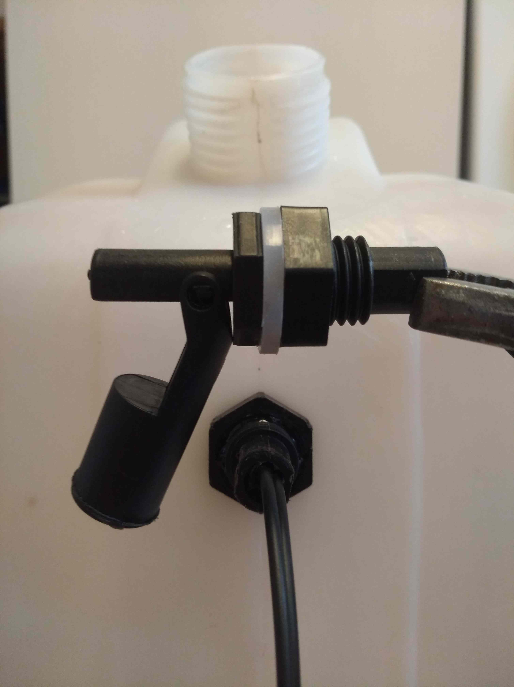

# Automatic Canister Filling 

This is a simple project to control a water outlet by the water level of a canister or a switch. 
I am using this in combination with an osmosis plant to fill canisters with omsosis water.

**Old Setup**

The 12V solenoid valve is used to enable or disable the water outlet. 
It is controlled by a switch which allows it to be permanently on, permanently off or controlled by the water level switch.
The water level switch is placed inside the canister and can be mounted in such a way, that it opens when the water level rises above.
An RGB LED is used to indicate which switch positions are activated. 
All components are connected to a 12V power supply. 

**New Setup** 

I added a microcontroller to the project to enable more features. 
For example, a timer can be used to disable the solenoid valve regardless of the water level switch.
Additionally, the LEDs can be configured in a more intuitive way.

[See project on GitHub](https://github.com/lm4552/automatic_canister_filling)

### Modes

|0|I|II|
|--|--|--|
|On|Off|Water Level Switch|

|Yellow/Green|None|White|Blue|
|--|--|--|--|
|On|Off|On (Water Level Switch closed)| Off (Water Level Switch open)|

### New Schematic
 

### Old Schematic
 

### Images 

||
|---|
|Solenoid valve connected to a water outlet|

||
|---|
|Case with the Mode Switch and LEDs|

||
|---|
|Canister with water level switch|

 

